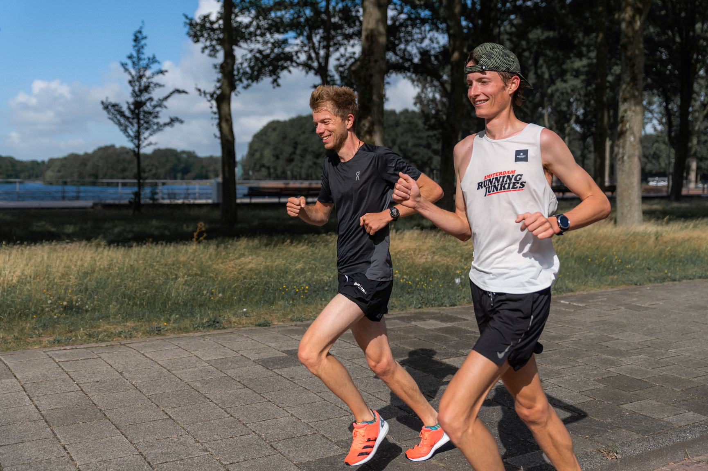

*Pacer Yoshi and me during the successful sub 3 marathon effort*

# Previous attempts

Since I started running in 2012, until late 2017 I'd never thought about running a marathon. That was something I might do when I was in my mid-30s — little did I know that I'd get into a competitive marathon mindset soon to follow. After joining the [Amsterdam Running Junkies](https://runningjunkies.nl) I was inspired by so many runners taking on the marathon that I signed up for Rotterdam Marathon.

After finishing Rotterdam Marathon 2018 in `4:25`, five weeks later I ran Copenhagen in `3:31` and the October marathon of Berlin in another `3:31`, followed by a slow training marathon and a DNF (did not finish) in Rotterdam 2019. A new attempt in Amsterdam, during the fall of 2019, led to a `3:03` finish time. So close!

The happiness about this improvement was a little muted by not being able to break the sub 3-hour barrier yet. Quite funny how much power we give arbitrary numbers over our lives. If our ancestors would have chosen to put 100 minutes into an hour, I would probably have been equally happy with a sub 2-hour marathon (3:20 in our time system).

I was determined to get that sub 3, but once again my motivation and fitness had a little dip during late 2019 / early 2020. And then came COVID-19 with all its freed up calendar space...

# Training schedule

Especially at the beginning of the COVID-19 lockdown in The Netherlands, running became an important pillar of my daily life. Contrary to previous race preparations I didn't stick to a fixed daily training schedule with detailed instructions; I just went out and ran. 

A day-to-day schedule can be somewhat stressful or demotivating in my experience since you have a chance of failing every single day and no way to compensate. That's why this time my only rule was hitting a weekly kilometer target, which I never increased by more than 10% per week. At the end of every week, I decided if I felt like I could handle an increase in the week to follow. The last 7 weeks before tapering I was running 70-90km per week.

When it came to speed, I just ran as fast as I felt like in the moment. I didn't do intervals, except for some Strava segment hunting that was going on in my running crew. If I needed more recovery I just took it easy the next day. I started preferring frequent small runs over fewer longer runs, keeping just one weekday for rest.

And it worked: this loose volume training — referred to by some as junk miles — even helped me run a minute off my 5k PR, that I had been attacking for years with speed training.

Even though I'm happily continuing on this path, I don't want to suggest you should write off detailed schedules completely. In the past, those schedules actually helped me push boundaries and learn that pain doesn't always mean you can't do more exercise the day after!

# Food

Food is pretty important in a marathon preparation, and there are a few things to consider:

1. day-to-day meals;
2. exercise fuel;
3. carb loading.

You need to increase your **day-to-day meals** if you're training for a marathon. Strava translates my 70km weeks into 4000kcal worth of energy, roughly 600 kcal a day, so I try eating an extra (warm) meal per day. Besides that, I make sure I have plenty of (unhealthy) snacks lying around the house, which I enjoy as long as they don't compete with my veggies.

What's also worth noting is that I eat fully vegetarian and 95% strict plant-based / vegan. I believe this can help out with not feeling bloated and having a quick muscle recovery. There is a growing list of world-class athletes that claim it's vital for their success. I'm not going to repeat all the names here that I've seen over the past few years since that requires fact-checking all of them individually (some have switched back to flexitarianism).

A typical food day of mine looks like this:

* oatmeal porridge with soy milk, banana & berries;
* 1 bread meal with spreads and toppings that are often legume-based;
* 1 or 2 warm meals with a lot of veggies, legumes, nuts, plain carbs;
* 3 - 5 pieces of fruit;
* a lot of chocolate, cookies, crisps, fries, sodas, and beer in-between.

When it comes to **exercise fuel**, to bring on a run, I'm pretty boring. I usually just bring water and a single Nakd bar with me, which is often enough for any distance up to 30km. At the start of my tapering, I train a few times with the fuel that I also take during the race, which is Maurten sports drink. During my successful sub 3 effort, I drank 250ml of *Maurten 320* sometime before the start and then every 6,5km. In the third-last and last bottle, I put *Maurten 160* because it's easier to drink and I tend to get food-induced nausea towards the end of a race.

Compared to my last sub 3 effort I also changed my **carb-loading** strategy. In preparation for my unsuccessful attempt, I had decided to do most of the carb loading two days before the race and take it a little bit easier on the last day, to feel 'light on the stomach'. This was just plain stupid and it bit me in the back at the end of the race.

That's why this time I chose to absolutely stuff myself with everything easy to eat, high on carbs, and low on fiber. I even sipped apple juice in-between meals for the whole day. The last plate of pasta made its appearance after 10 p.m. Worked like a charm!

# Shoes

In 2015 I switched to barefoot running. This doesn't mean I actually run barefoot, but instead, I try to mimic barefoot running as much as possible while still having some skin protection. My current favorite brand is [Vivobarefoot](https://www.vivobarefoot.com).

The benefits of barefoot running are not fully proven by science yet, but it's clear that a midfoot strike is how we are evolved to run. There is also [proof](http://barefootrunning.fas.harvard.edu) that a midfoot strike – opposed to a heel strike – leads to **less impact force** going through the knees, back, and rest of the body.

It's possible to have a midfoot strike on cushioned shoes, as long as the shoes are zero drop. For me, the benefit of also removing most of the cushioning is that it forces me to get a resilient running technique. Ultimately it became just as comfortable and I wouldn't want to go back now.

# Tapering and race day

Another thing I've learned is that you can only do harm with your training in the last 1-2 weeks before a marathon. This is the first time I didn't stick to any speed or distance goals in the last 2 weeks, and it was totally fine! What works for me is running my last ±30km three weeks before race day and optionally running another 20km two weeks before race day, but only if I feel super fresh and free of pain.

# Figuring out the why

But why do I want to endure all this suffering during a race? What's the point? I still have difficulty answering this question at times. I do enjoy most of my training and the excitement of race prep, but when a race gets tough I can sometimes quickly get into a negative mindset.

Some people run long distance to prove that they can set a goal and achieve it. Other people run races so they have something to work up to, becoming faster in the process. But these goals feel somewhat empty to me; it's like reasoning in circles. They rarely help me to get out of that negative mindset.

I'm searching for motives that will prevent me from getting into that negative mindset at all. Motives that will also keep me a happy runner when I'm too old to set higher goals. I want to focus on simply enjoying being outside, in the mountains, being with other runners, taking a different route than planned, feeling fit and healthy. Maybe I'll stop doing road races at some point, in favor of trail running. On the trails, it feels like happiness just pours over me in huge quantities.

Anyway, for this successful sub 3 effort, I just had a very vain motivation: a shitload of people showed up to cheer and my last attempt was just 3 minutes short. There was no way in hell that I would embarrass myself in front of all these people.

# Social running framework

Lastly, you will likely get a lot better by joining a running team or crew. I started running in 2012 but ran 75% of my total kilometers since I joined my crew at the end of 2017. They become part of '*why you run*' and inspire you to go out more often.

> Running is way better when you approach it as a team sport.

# Privilege

Above I'm listing many things that I did to get my desired marathon time. What's still missing is the fact that privilege also played a huge part in this. I happen to have a job and live in a country where I can safely run as much as I want, being a healthy 1.92m male.

This is not just meant as a guilt-relieving disclaimer, but it's something I want to make myself genuinely more aware of. Everyone has their battles and personal goals and I want to be more of a person that empowers others instead of priding myself on my achievements.

> Thanks for reading my takeaways! If you want to see my training in more detail just check out my [Strava](https://www.strava.com/athletes/gersom).