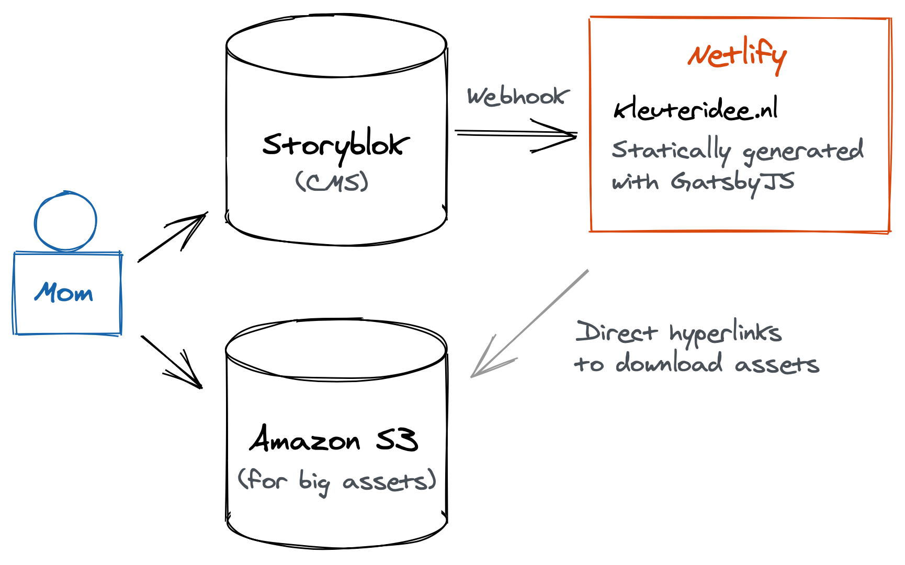

This post is about solving a particular issue that I encountered while rebuilding my mother's website [Kleuteridee.nl](https://kleuteridee.nl), on which Dutch kindergarten teachers can find various downloads. The website experienced a spike in homeschool visitors during the COVID-19 school closures, exceeding the limits of the managed Wordpress hosting.

In order to make the website faster, enable it to further scale, and simplify the hosting, I decided to rebuild the website using [Storyblok](https://storyblok.com) as CMS and [Gatsby](https://gatsbyjs.org) for the front end. The end product needed to be easy to use for my mother and cheap enough in order to not burden her with high monthly bills.



_Check out the free and awesome [Excalidraw](https://excalidraw.com) if you want to make similar sketches._

My **main two goals** were:

- Don't exceed the 1TB bandwidth limit of Storyblok, since the next TB costs \$170.
- Stay within the 400GB bandwidth limit of Netlify's pro plan.

For Storyblok I hope to manage this by using Gatsby Image's responsive image component, combined with Storyblok's image resizing service. Gatsby loads the smallest image needed for display on the visitor's device and doesn't load the image before it is scrolled into view. If there would be future spikes in traffic, I can quickly turn on more aggressive image compression.

For Netlify it was a bit more tricky. Gatsby generates a `page-data.json` file for every page, that is prefetched whenever a link to that page scrolls into view. My mother's website has a gigantic side menu, showing all the 150+ pages, and those pages are long, meaning large `page-data.json` files.

If a visitor scrolls down, past the side menu, the browser would download 4.5MB worth of page data. Last month my mother had 100.000 visitors on her website, potentially leading to 450GB worth of bandwith just for preloading some pages. I was left with a choice: not using Gatsby's `<Link>` and therefore not having any preloading or trying to compress the page data. I chose the latter.

# The solution

After playing around with several JSON compression libraries, I found that compressing a stringified version of the data using [pako](https://github.com/nodeca/pako) worked best. This got me down from 4.5MB to 1.7MB of page data, saving a potential 280GB of monthly bandwidth.

```javascript
// gatsby-node.js

const pako = require('pako');

const page = {}; // Page data derived from Storyblok's API

const context = {
  compressed: pako.deflate(JSON.stringify(page), { to: 'string' }),
};

actions.createPage({
  path: `/${page.path}`,
  component: PageComponent,
  context,
});
```

```javascript
// PageComponent.js

import pako from 'pako';

const PageComponent = props => {
  const content = React.useMemo(
    () =>
      JSON.parse(pako.inflate(props.pageContext.compressed, { to: 'string' })),
    [props.pageContext.compressed]
  );

  // Return the page JSX
};

export default PageComponent;
```

I'm wondering if there are other people who had a similar challenge. Please let me know if this was you and how you solved it! You'll find me on [Twitter](https://twitter.com/gersomvg).
