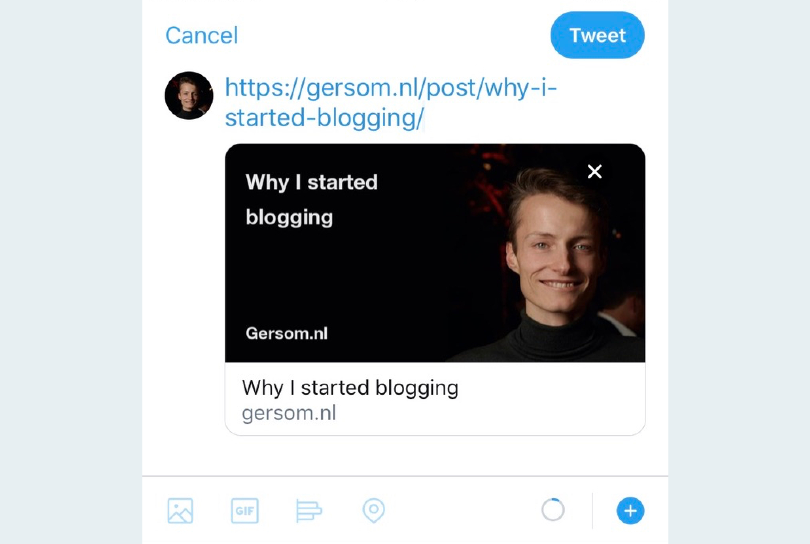

If you don't know what an `og:image` is, just have a look at the picture below. Open Graph images show up the moment you share a link to Facebook, LinkedIn, Twitter, WhatsApp, etc. As you can see, I chose to compile the image from the post title, website URL and a personal photo.



There is some prior art on auto-generating `og:image`, for example [Open Graph Image as a Service](https://github.com/zeit/og-image) by Zeit. They've built an API endpoint that generates the image on every request. I didn't want to have a separate API function because it feels like a waste of resources if the images don't change after deploy anyway. It turns out to work wonderfully in Netlify's build step!

_The steps involved in generating the images are:_

1. Initiating the script during Gatsby's `onPostBuild`
2. Booting up puppeteer (Chrome)
3. Rendering an HTML template
4. Updating the H1 element with the post title
5. Making a screenshot and saving it to `/public`
6. Repeating steps 4 and 5 for all posts.
7. Configuring the Open Graph / Twitter meta tags

# Initiating the script during Gatsby's onPostBuild

The Gatsby `onPostBuild` API only runs when building for production and not during development. For this reason we will be using it, since we don't need `og:image` during development, and generating them slows down compilation.

Here is an example of how I take all the posts from the Gatsby data layer and send them to the function that generates the images. The query might look different for your use case, since I use `.mdx` files as a data source, with frontmatter for metadata.

```javascript
// gatsby-node.js
import generateOgImages from './src/scripts/generate-og-images';

exports.onPostBuild = async ({ graphql }) => {
  const result = await graphql(`
    query {
      posts: allMdx {
        nodes {
          fields {
            slug
          }
          frontmatter {
            title
          }
        }
      }
    }
  `);
  await generateOgImages(result.data.posts.nodes);
};
```

# Booting up puppeteer (Chrome)

We'll render HTML in puppeteer and screenshot it, in order to get our image. Puppeteer is a bit too heavy for the Netlify build step and won't work. We'll work around this by using a package called `chrome-aws-lambda` that is made to work within the limitations of a AWS Lambda function.

```shell
npm i chrome-aws-lambda puppeteer-core
npm i -D puppeteer
```

By accessing puppeteer through the `chrome-aws-lambda` instance, we'll automatically get the right chromium for our context (local development vs. Netlify).

```javascript
// generate-og-images/index.js
const chromium = require('chrome-aws-lambda');

module.exports = async posts => {
  const browser = await chromium.puppeteer.launch({
    args: chromium.args,
    executablePath: await chromium.executablePath,
    headless: chromium.headless,
  });

  const page = await browser.newPage();

  // Here we'll add the screenshot logic

  await browser.close();
};
```

Ok, I'm kidding, it does not work outside of the box. The Netlify build step runs with `NODE_ENV=development`, which confuses `chrome-aws-lambda`. We could work around this by setting the NODE_ENV to production, but this has unintended side effects. Another way to force using the serverless chrome instance is by setting the `AWS_LAMBDA_FUNCTION_NAME` environment variable ([docs](https://github.com/alixaxel/chrome-aws-lambda/wiki/HOWTO:-Local-Development#environment-variables)).

Netlify does let us set this environment variable through their UI, so we'll just hack it into our netlify config.

```toml
# netlify.toml
[build]
  command = "AWS_LAMBDA_FUNCTION_NAME=trickpuppeteer npm run build"
```

# Screenshotting HTML templates

In the same folder as the script, we'll create an HTML template file.

```html
<!-- generate-og-images/template.html -->
<html>
  <head>
    <meta charset="utf-8" />
    <style>
      /*SEE THE REPOSITORY FOR ALL THE STYLES*/
    </style>
  </head>

  <body>
    <section>
      
      <h1 id="title">
        Lorem ipsum dolor sit amet
      </h1>
      <p>Gersom.nl</p>
    </section>
  </body>
</html>
```

Then we'll load this HTML file into our script and inject it into puppeteer to make screenshots.

```javascript
// generate-og-images/index.js
const chromium = require('chrome-aws-lambda');
const fs = require('fs');
const path = require('path');

module.exports = async posts => {
  const browser = await chromium.puppeteer.launch({
    args: chromium.args,
    executablePath: await chromium.executablePath,
    headless: chromium.headless,
  });

  const page = await browser.newPage();

  // Load html from template
  const html = fs
    .readFileSync(path.resolve(__dirname, './template.html'))
    .toString();

  // Render html
  await page.setContent(html, {
    waitUntil: ['domcontentloaded'],
  });

  // Wait until the document is fully rendered
  await page.evaluateHandle('document.fonts.ready');

  // Set the viewport to your preferred og:image size
  await page.setViewport({
    width: 1200,
    height: 632,
    // My macbook is retina, so this should be 2 while testing locally
    deviceScaleFactor: process.env.NETLIFY === 'true' ? 1 : 2,
  });

  // Create an og-images directory in the public folder
  const dir = path.resolve(__dirname, '../../../public/og-images');
  if (!fs.existsSync(dir)) fs.mkdirSync(dir);

  // Go over all the posts
  for (const post of posts) {
    // Update the H1 element with the post title
    await page.evaluate($post => {
      const element = document.querySelector('#title');
      element.innerHTML = $post.frontmatter.title;
    }, post);

    // Save a screenshot to public/og-images/slug-of-post.jpeg
    await page.screenshot({
      path: `${dir}/${post.fields.slug.replace(/\//g, '')}.jpeg`,
      type: 'jpeg',
      quality: 100,
      clip: { x: 0, y: 0, width: 1200, height: 632 },
    });
  }

  await browser.close();
};
```

This should run without error, but if you try this yourself, you'll find that the relative paths to the avatar (and font-face declarations in CSS) won't resolve in puppeteer. I ended up base64-injecting them:

```javascript
// generate-og-images/index.js
let html = fs
  .readFileSync(path.resolve(__dirname, './template.html'))
  .toString();

let avatar = fs.readFileSync(path.resolve(__dirname, './avatar.jpeg'), {
  encoding: 'base64',
});
html = html.replace(
  './avatar.jpeg',
  `data:image/jpeg;charset=utf-8;base64,${avatar}`
);

let font = fs.readFileSync(path.resolve(__dirname, './Roboto-Bold.ttf'), {
  encoding: 'base64',
});
html = html.replace(
  "'./Roboto-Bold.ttf'",
  `data:application/x-font-ttf;charset=utf-8;base64,${font}`
);
```

# Configuring the Open Graph / Twitter meta tags

Lastly, we organize our meta tags, so Twitter, WhatsApp and others know where to find our image.

```javascript
import Helmet from 'react-helmet';

// DEPLOY_URL is a Netlify environment variable.
// You can set this to localhost in a .env.development file, for dev testing.
const image = `${process.env.DEPLOY_URL}/og-images/${slug}.jpeg`;

<Helmet>
  <meta property="og:image" content={image} />
  <meta name="twitter:image" content={image} />
</Helmet>;
```

> **That's it, thanks for reading!** Let me know on [Twitter](https://twitter.com/gersomvg) if this worked for you.
